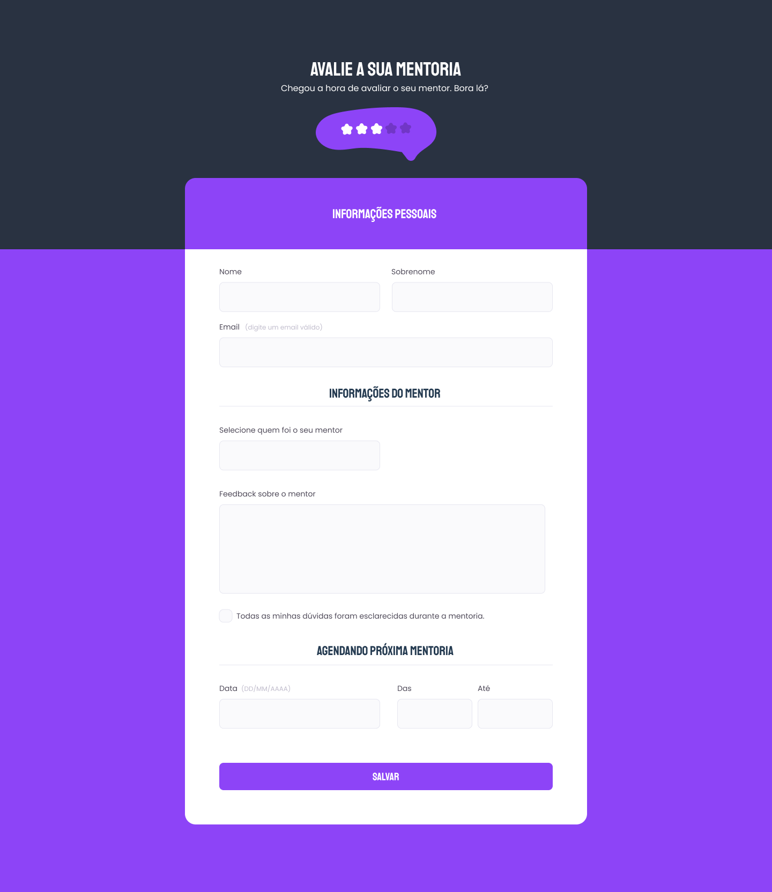

<h1 align="center"> Desafio-2-extra </h1>

Desafio 2 de formulário da Rocketseat, um formulário mais avançado com opções select e checkbox estilizado.

  <a href="#-tecnologias">Tecnologias</a>&nbsp;&nbsp;&nbsp;|&nbsp;&nbsp;&nbsp;
  <a href="#-projeto">Projeto</a>&nbsp;&nbsp;&nbsp;|&nbsp;&nbsp;&nbsp;
  <a href="#-layout">Layout</a>&nbsp;&nbsp;&nbsp;|&nbsp;&nbsp;&nbsp;
  <a href="#memo-licença">Licença</a>

  

 

  

## 🚀 Tecnologias

Esse projeto foi desenvolvido com as seguintes tecnologias:

- HTML e CSS
- Git e Github

## 💻 Projeto

Neste desafio criei um formulário de nível avançado com opções select e checkbox estilizado.

## 🔖 Layout

Você pode visualizar o layout do projeto através [DESSE LINK](https://www.figma.com/file/x8vUypVGMYS67txnfxSoTn/Stage-03---Formul%C3%A1rio-avan%C3%A7ado-(Copy)?node-id=0%3A1&t=YnYCRWwY0L2e8K4O-1). É necessário ter conta no [Figma](https://figma.com) para acessá-lo.

## :memo: Licença

Esse projeto está sob a licença MIT.

---

Feito com ♥ [Participe da nossa comunidade!](https://discord.gg/rocketseat) :wave:
